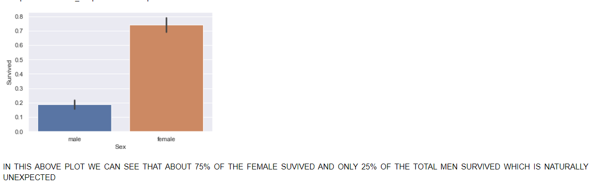

# Solving some Weird Facts of Titanic
***

### ***Description***
***

Titanic is a very interesting case study, and also
a very nice way to see our Data Analysis skills.
In this project we have gone through a very deep
analysis to search for a weird facts
 
 
 
While doing this Project I came Across this Plot

***

 
 
 
 ***
  
 
 This figure Shows that the ratio of total no of Females survived on  
 that day is significantly greater then the ratio of Male survived 
 ,so we can see one of the major reasons for this outcome.